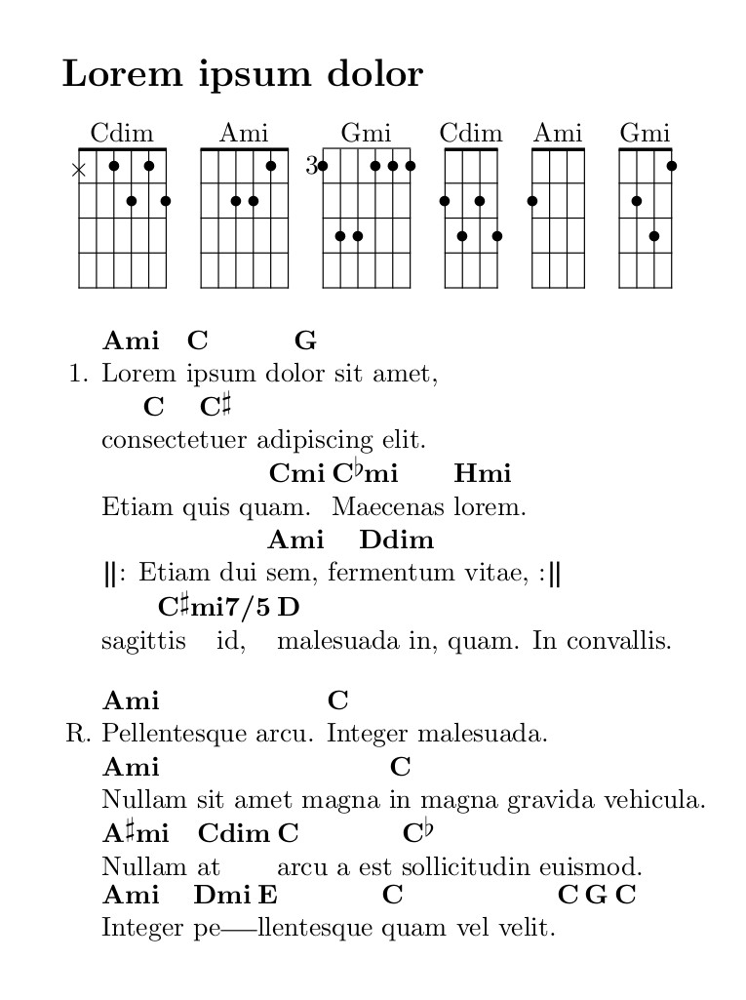

# yaguitar
Yet another TeX style for guitar chords

## Motivation
The main goal is to make song typing as simple as possible. Also using international characters is mandatory.

## Using yaguitar
Yaguitar style works in both - plainTeX and LaTeX

### Commands
#### \chord
#### \chordScheme
#### \ukeChordScheme

### Guitar environment
Yaguitar defines new environment _guitar_. In LaTex use

    \begin{guitar}
    \end{guitar}

In plainTeX use

    \guitarOn
    \guitarOff

Inside guitar environment some characters are active (square bracket, pipe, space and new line). This allows stretch text under
chords when it is needed.

### Quick Start Guide

The above song was created with this LaTeX code:

    \section*{Lorem ipsum dolor}
    
    \chordScheme{Cdim}{-1}{0}{1}{2}{1}{2}{}
    \chordScheme{Ami}{0}{0}{2}{2}{1}{0}{}
    \chordScheme{Gmi}133111{3}
    \ukeChordScheme{Cdim}{2}{3}{2}{3}{}
    \ukeChordScheme{Ami}{2}{0}{0}{0}{}
    \ukeChordScheme{Gmi}0231{}
    
    \begin{guitar}
    \strophe{}%
    [Ami]Lorem [C]ipsum do[G]lor sit amet,
    con[C]secte[C#]tuer adipiscing elit.
    Etiam quis qu[Cmi]am. [Cbmi]Maecenas [Hmi]lorem.
    |: Etiam dui [Ami]sem, fer[Ddim]mentum vitae, :|
    sagit[C#mi7/5]tis id, [D]malesuada in, quam. In convallis.
    
    \refrain{}%
    [Ami]Pellentesque arcu. [C]Integer malesuada.
    [Ami]Nullam sit amet magna [C]in magna gravida vehicula.
    [A#mi]Nullam [Cdim]at [C]arcu a est [Cb]sollicitudin euismod.
    [Ami]Integer [Dmi]pe[E]llentesque [C]quam vel velit.[C][G][C]
    \end{guitar}
